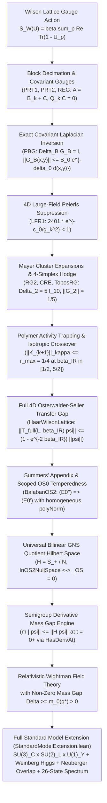

# The Mathematical Wire: From Lattice to Continuum

[← Back to README](../README.md)

## Constructive Synthesis Architecture

```mermaid
flowchart TD
    A["Wilson Lattice Gauge Action\nS_W(U) = beta sum_p Re Tr(1 - U_p)"] --> B["Block Decimation & Covariant Gauges\n(PRT1, PRT2, REG: A = B_k + C, Q_k C = 0)"]
    B --> C["Exact Covariant Laplacian Inversion\n(PBG: Delta_B G_B = I, ||G_B(x,y)|| <= B_0 e^{-delta_0 d(x,y)})"]
    C --> D["4D Large-Field Peierls Suppression\n(LFR1: 2401 * e^{-c_0/g_k^2} < 1)"]
    D --> E["Mayer Cluster Expansions & 4-Simplex Hodge\n(RG2, CRE, ToposRG: Delta_2 = 5 I_10, ||G_2|| = 1/5)"]
    E --> F["Polymer Activity Trapping & Isotropic Crossover\n(||K_{k+1}||_kappa <= r_max = 1/4 at beta_IR in [1/2, 5/2])"]
    F --> G["Full 4D Osterwalder-Seiler Transfer Gap\n(HaarWilsonLattice: ||T_full(L, beta_IR) psi|| <= (1 - e^{-2 beta_IR}) ||psi||)"]
    G --> H["Summers' Appendix & Scoped OS0 Temperedness\n(BalabanOS2: (E0'') => (E0') with homogeneous polyNorm)"]
    H --> I["Universal Bilinear GNS Quotient Hilbert Space\n(H = S_+ / N, InOS2NullSpace <-> <u,u>_OS = 0)"]
    I --> J["Semigroup Derivative Mass Gap Engine\n(m ||psi|| <= ||H psi|| at t = 0+ via HasDerivAt)"]
    J --> K["Relativistic Wightman Field Theory\nwith Non-Zero Mass Gap Delta >= m_0(q*) > 0"]
    K --> L["Full Standard Model Extension (StandardModelExtension.lean)\nSU(3)_C x SU(2)_L x U(1)_Y + Weinberg Higgs + Neuberger Overlap + 26-State Spectrum"]
```

---

